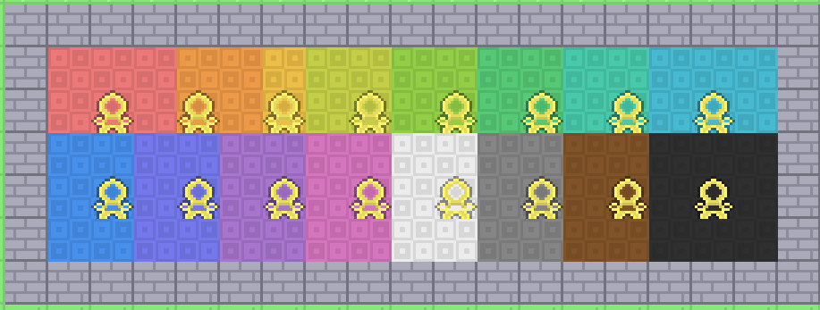
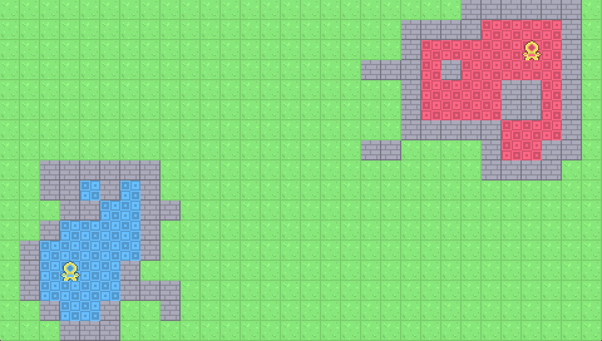

# 🏰 Castellomino
::toc::
A work-in-progress pentomino territory game I'm building in GameMaker Studio 2. Place pentominoes to wall off land, claim territory for your throne, and break walls to expand your reach - there's more to come.

╔═══════════════════════════════════╗
║                                   ║
║        🎮 **[PLAY IN BROWSER](castellomino/index.html)**            ║
║                                   ║
╚═══════════════════════════════════╝
> Press F11 for fullscreen, makes it a much better experience.

**Controls**
- **WASD** - Move camera
-  **LMB** - Place piece
-  **RMB** - Hold 1s to break wall
-  **Q/E** - Rotate
-    **F** - Flip
-    **R** - Reroll piece
-    **P** - Restart game
-    **H** - Toggle help

## 🔄 Uodates

**Assets**
 - No downloadable assets, you may request them in the [Discord](https://discord.gg/2USS2tgDgE).

### 📦 2026.10.10 - Even More Teams

Seriously, we're all the way up to sixteen now. Thanks for all the feedback on the team colors. I added some of the ones that made sense.

**The sixteen:**

red, orange, amber, yellow, lime, green, teal, cyan, blue, indigo, violet, magenta, white, gray, brown, black

Twelve hues spaced evenly around the color wheel, plus four earth tones filling the gaps.

### 📦 2026.10.05 - Basic mechanics. Sandbox.

Place pentominoes to seal off regions of the map. Any enclosed empty space connected to your throne gets claimed for your team. Hold right-click on a wall your territory touches to break it, opening new paths to expand.

Up to 12 teams in play, each with their own throne and color. Rotate pieces with Q and E, flip with F, reroll with Z. The help panel in the top-left shows every control, toggle it with H.

